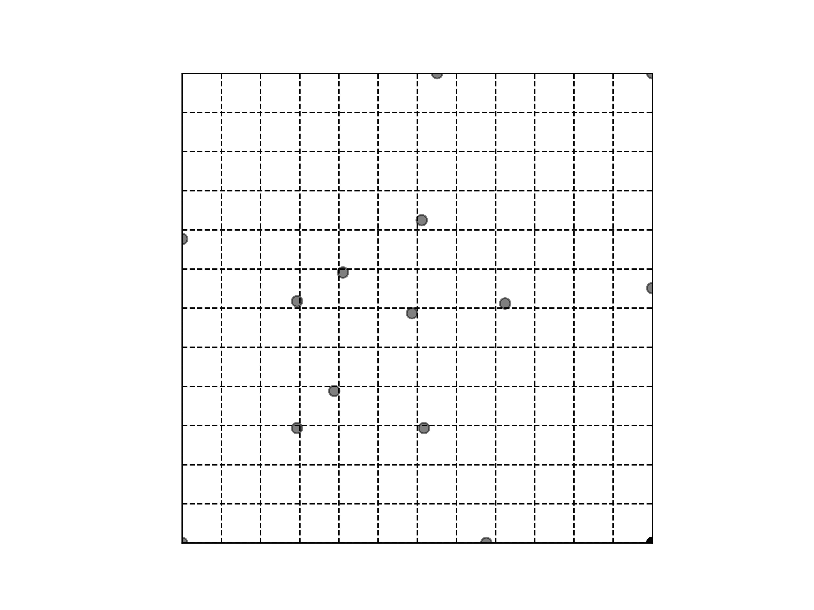

### Grid Approximator

Given a Treemaker tmd5 file approximates a grid. Work in progress.

To run:
```
python main.py <tmd5 file> [<output filename>.png]
```



Issues
- Primitive cost function. Regularizes based on the grid size.
- Might end up mapping multiple points to the same grid intersecton.
- Doesn't account for the actual circle packing yet.
- Brute force optimization for now: it tries only till a 256 grid.
